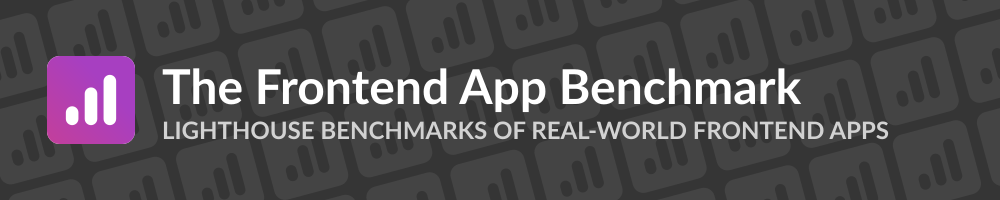

# The Frontend App Benchmark

<p>

</p>

The _Frontend App Benchmark_ tries to capture Lighthouse performance stats of "real-world" frontend applications built with several frontend frameworks/libraries.

[Read more about it here!](https://frontend-app-benchmark.pages.dev/)

---

## Application Types

**The current application types we benchmark are:**

### Hacker News

Reimplements the famous https://news.ycombinator.com/ site.

We benchmark the initial load of the following pages:

- Homepage (story listing)
- Story details with comments

See the [instructions](./app-instructions/hacker-news/README.md) what every app has to implement and how to use the provided API.

### Ecommerce (WIP)

_This application isn't supported yet._ It will implement a simple ecommerce site. It's planned to benchmark the following page types:

- Product listing
- Product details

See the [instructions](./app-instructions/ecommerce/README.md) what every app has to implement.

## The Benchmark Process

Every application gets benchmarked on the same physical machine:

```
OS: Windows 10
CPU: AMD Ryzen 7 3700X (AM4, 3.60GHz, 8-Core)
SSD: Samsung 970 EVO Plus 500 GB PCIe 3.0
Mainboard: MSI B550M PRO-VDH
```

Every application has to use the same REST API. For that, we provide a Backend for every application type written in Go. So every application uses the same data for the benchmark. When doing the benchmark, the backend gets hosted on the same machine next to the frontend app. With these techniques, we want to make sure that no application has advantages because of backend performance characteristics.

For every application and page type, we ran _15_ Lighthouse benchmarks. We use the _median_ Lighthouse performance score of all Lighthouse runs as the prominent result.

_TODO: add docs about the Lighthouse settings used to execute a run._

## Adding a New Project

We appreciate PRs for new projects! ❤️  
Here are the steps to take:

1. Create a folder under the `apps` folder and give it a useful name, for example `solid-ssr-hydration`.
1. Follow the instruction guide for your application type:
   1. [Hacker News](./app-instructions/hacker-news/README.md)
   2. [Ecommerce](./app-instructions/ecommerce/README.md)
1. Ensure that there's a npm script called `build` that builds the project for production.
1. If your app doesn't use a node/deno server (in most cases in a classical SPA project), please make sure that all built files are inside a `dist` folder. All these files will be served by an Nginx server. The goal is here that all apps without an SSR part use the same webserver.
1. If you use a server (for example in SSR apps), please add a Dockerfile that generates a self-contained Docker image.
   1. Make sure that the Docker image contains all files (so no volumes) and runs the server without the need to provide CLI arguments.
   1. Make sure that the server listens on the port `3000` (TCP) and uses `http` as the protocol.
